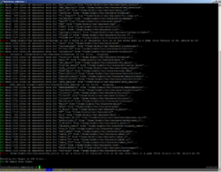
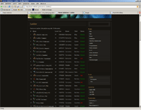

  Around 2006, I ran a small (~100 users) Diablo II Battle.net Server for a while, using the
  open source software <a href="http://www.pvpgn.org/">PvPGN</a>. I wrote some tools like a dupescanner
  and a web ladder etc. for it. The server doesn't exist anymore, but I thought I'd share the tools.

  Disclaimer: The code quality is a total shitshow. This was more than 10 years ago. I just started Ruby.
  Still doing mostly (also terrible) Perl stuff. Don't judge me. But I hope some people might get some
  use out of this anyway.

<h1>Diablo II</h1>

  This little site is a collection of some small utility software I wrote for my
  <a href="http://pvpgn.berlios.de/">PvPGN</a> server. For those of you who don't know, PvPGN is a piece of
  free GPL software that emulates the well known "Battle.Net" services, provided by Blizzard Entertainment.
  I am using it to host a <b>Diablo 2 1.09d Classic Realm</b> on a Linux box (so all the software is developed
  with linux in mind, but with some minor adjustments, it should work on Windows, too).

  Thanks to <a href="http://heipei.net/">Johannes "heipei" Gilger</a> for his support. He did some
  parts of the coding, especially the Ruby stuff.

<h3>TOC</h3>

<ul>
  <li><a href="#dupescanner">Dupescanner</a></li>
  <li><a href="#itemcounter">Item Counter</a></li>
  <li><a href="#charlist">Charlist</a></li>
  <li><a href="#webuserlist">Web Userlist</a></li>
  <li><a href="#usage">Resource Usage</a></li>
  <li><a href="#ladderbug">Ladder XML Output Bug in PvPGN 1.8.0rc2</a></li>
  <li><a href="#ladderparser">PHP XML Ladder Parser</a></li>
  <li><a href="#charcounter">Char counter</a></li>
  <li><a href="#additional">Additional command line tools</a></li>
  <li><a href="#links">Links</a></li>
  <li><a href="#contact">Contact</a></li>
</ul>

<h3><a name="dupescanner">Dupescanner</a></h3>

  

  A dupe scanner is very important for an 1.09d server because duping was not that hard in Diablo 2 1.09d. To dupe means to
  duplicate an item, which is a way of cheating, because you can "make" as many copies as you like of any item you like. It is
  obvious that an administrator (who wants his users not to cheat on each other) needs to restrict the possibility of duping.
  Well, as a matter of fact, I dont think that it is possible to restrict it (without upgrading to newer versions of Diablo, but
  I definetly want to use 1.09d) <b>but</b> when I cant restrict it, I at least can <b>detect</b> it (and delete the user who
  duped). This is where my software comes in.

<ul>
  <li><a href="files/dupescan">Download dupescan</a></li>
  <li>Change the DEFINE for the directory where the charfiles are</li>
  <li>Run "make" to compile it</li>
  <li>Run "./dupescan -s" (you may also want to use "-q") to scan</li>
</ul>

  For additional information on implementation see <a href="files/dupescan/README">the README file</a>

  Unfortunately, if you detect a dupe, means, you detect two items with the same fingerprint, you cannot tell which one
  was the original and which one is the dupe. So, if you have two users with the exact same item, you cant tell who cheated
  and who got the item from the cheater thinking it is legit (or maybe both cheated, you will never know). You will have to
  live with that. I used to delete both copies of the item, even if that means deleting a legit item.

  <b>Note</b> that I am running a HC only server. That means, that every char is a hardcore char. When a hardcore char dies,
  he is dead. There is no "restart in town". Dead in the literal sense. No resurrection. My dupescanner will still work on SC
  chars, but they may be able to hide the dupes. The reason is, that there are different item sections in every char file. One
  main item section, which holds your equipment, inventory, belt and stash. That is the only section my software scans for
  dupes. But, there are other sections. Like a corpse section. When you die in SC and leave the game, the next time you will
  enter a new game, you will see your corpse on the ground, holding all your stuff ready for you to pick up. If a character
  has a duped item in his corpse, my software wont detect it

  <b>Also note</b> that I am using a Diablo 2 classic server. In Diablo 2 Classic, it is not possible to equip your merc. In
  Lord of Destruction, it is. So, if you are using a LoD Server and one of your users equips his merc with a duped item, my
  software wont notice.

  For those of you who are using windows to host their games: You may also want to have a look at
  <a href="http://atma.diabloii.net/">ATMA</a>, which also includes a dupe scanner. I just could not use that one for my
  server because I am running linux and I am way to lazy to download all the chars and scan them manually.

<h3><a name="itemcounter">Item Counter</a></h3>

  My users wanted a way to see how many SoJ exist on the server, so I coded a little program which reads the characters and
  counts all the items. I just needed SoJ but I added the following item classes:

<ul>
  <li>low quality item</li>
  <li>normal quality item</li>
  <li>high quality item</li>
  <li>magical item</li>
  <li>set item</li>
  <li>rare item</li>
  <li>unique item</li>
  <li>SoJ</li>
</ul>

<ul>
  <li><a href="files/itemcounter">Download</a></li>
</ul>

<h3><a name="charlist">Charlist</a></h3>

  <i>charlist</i> is a little tool which parses all the charfiles, reads the level and the class (barb, sorc, ...) and
  characters status (dead or alive). It then prints out a space seperated list which is easy to parse by my "Web Userlist"
  script.

  The output will look like that:

<pre>
  [0]flo@classic-addiction:~$ charinfo
  flo FMS_Storm 60 Sorc alive
  flo FMS_Kitana 38 Amazone alive
  flo FMS_HurricanE 39 Barb alive
  flo FMS_Cleric 18 Paladin dead
  flo FMS_TheWatcher 26 Nec alive
  flo FMS_LifeSuxx 37 Sorc alive
  flo FMS_ChuckNorris 33 Barb alive
  flo FMS_PennyLane 31 Sorc alive
</pre>

  First row is the account name, second row is the charactername, third row level, class, status.

  I use this software to periodically write its output to a place the webserver can read it so my php site can parse
  the charlist.

<ul>
  <li><a href="files/charinfo">Download</a></li>
</ul>

<h3><a name="webuserlist">Web Userlist</a></h3>

  

  This one shows you a list of all accounts with status (online or offline) and some info (description, location, sex,
  creation date, ...). Additionally, it will show you a list of characters on the account including level, class and status!

  <b>Note</b> that this php file reads its data from a text file which contains the output of the <i>charlist</i> software!

  You will have to change the paths in both of the php files in order to make it work. I recommend you write the charlist.txt
  with cron.

<ul>
  <li><a href="files/users">Download</a></li>
</ul>

<h3><a name="usage">Resource Usage</a></h3>

  I needed a quick way to have a look at the servers memory and cpu usage from the linux console, so I wrote a little
  script that reads it data from "ps" (/proc/pid/mem would be smarter, but I did not think about that at the time).

  The output will look like that:

<pre>
  +-------+--------+--------+------------+------------+------------------------------------------+
  |  Proc |   CPU% |   MEM% |        VSZ |        RSS | PIDS                                     |
  +-------+--------+--------+------------+------------+------------------------------------------+
  | bnetd |   0.00 |   0.20 |     4.41 M |     1.91 M | 364                                      |
  |  d2cs |   0.00 |   0.10 |     2.27 M |   916.00 K | 26629                                    |
  | d2dbs |   0.00 |   0.10 |     2.87 M |     1.13 M | 2943                                     |
  |  d2gs |   0.00 |  34.50 |     1.62 G |   304.74 M | 2594 5980 699 32509 32225                |
  +-------+--------+--------+------------+------------+------------------------------------------+
  | Total |   0.00 |  34.90 |     1.63 G |   308.68 M | -                                        |
  +-------+--------+--------+------------+------------+------------------------------------------+
</pre>

<ul>
  <li><a href="files/usage.pl">Download</a></li>
</ul>

<h3><a name="ladderbug">Ladder XML Output Bug in PvPGN 1.8.0-rc2</a></h3>

  If you are using pvpgn-1.8.0rc2, you will notice, that there is something wrong with your titles. Some chars that
  are Dukes in the ingame ladder will be Countess in the exported XML ladder. This is a bug in the pvpgn software
  which I noticed and fixed.

  You can use my patch to fix this: <a href="files/ladder_xml_output_bug.patch.txt">ladder_xml_output_bug.patch</a>

<h3><a name="ladderparser">PHP XML Ladder Parser</a></h3>

  

  I wanted to add the ingame ladder to my servers website so that my users can have a look at it without joining the game.
  I just needed the "Hardcore Overall" ladder (there are also class-specific ladders and softcore ladders).

  You can config your pvpgn to export the ladder in XML, which is much more userfriendly than the internal binary format. I
  used SimpleXML to parse it, so you have to download it if you want to use my script.

<ul>
  <li><a href="files/ladder">Download</a></li>
</ul>

  You will have to change some variables in the PHP file so the script finds your stuff. And make sure the webserver has
  read permission on the files and directories (can be tricky with php safemode enabled).

<h3><a name="charcounter">Character counter</a></h3>

  For statistics, I needed a tool which counts all characters (dead and alive). <a href="files/charcounter">here it is</a>.

<h3><a name="additional">Additional command line tools</a></h3>

Some additional console tools:

<ul>
  <li>
    <a href="files/DuplicateAccs.pl">DuplicateAccs.pl</a> - I dont wanted people to use more than one account, so I
    wrote this tool. It scans for accounts which have the same password, lastlogin IP or lastlogin Windows username, since those
    things are indications that the accounts belong to the same person
  </li>
  <li><a href="files/EmptyAccounts.pl">EmptyAccounts.pl</a> - Scans for empty accounts so I could delete them</li>
  <li><a href="files/FindChar.pl">FindChar.pl</a> - Finds the account which hosts some given character</li>
  <li>
    <a href="files/LoginHighscore.pl">LoginHighscore.pl</a> - Prints an ordered list of accounts and the time of its last
    login, so you can see which account has not been used for the longest time
  </li>
</ul>

And some Ruby Scripts, provided by <a href="http://heipei.net/">Johannes Gilger</a>. Thanks for that!

<ul>
  <li>
    <a href="files/check-accounts.rb">check-accounts.rb</a> - Tests if file integrity is okay, for example file permissions
    of the character files and possible contradictions in the <i>charinfo</i> and <i>charsave</i> directory structures (which
    can happend if you do not properly delete an account)
  </li>
  <li>
    <a href="files/delete-account.rb">delete-account.rb</a> - Reports all filenames associated to a given account name, so
    you can fully remove that account without f*cking up the file integrity and leaving dead useless files
  </li>
  <li><a href="files/delete-char.rb">delete-char.rb</a> - Same as above, just for single character files instead of the whole account</li>
</ul>

<h3><a name="links">Links</a></h3>

<ul>
  <li><a href="http://www.ladderhall.com/ericjwin/109/trevin/trevinitemformat.html">Trevin Beattie's Diablo II Item Format</a></li>
  <li><a href="http://www.ladderhall.com/ericjwin/109/trevin/trevinfileformat.html">Trevin Beattie's Diablo II Saved Game File Format</a></li>
  <li><a href="http://home.stx.rr.com/svr/formats/d2s.htm">D2S File Format - Version 1.10</a></li>
  <li><a href="https://forums.pvpgn.org/">The PvPGN Support Forum</a></li>
  <li><a href="http://pvpgn.berlios.de/">PvPGN Website</a></li>
  <li><a href="http://www.blizzhackers.com/">blizzhackers.com - The edge of nowhere</a></li>
</ul>

<h3><a name="contact">Contact</a></h3>

  Feel free to contact me if you are having problems using my software or if you discover bugs. If you want to drop me a line,
  mail to "flo" at the websites domain (no direct mail adress here, too much spam, sorry).

